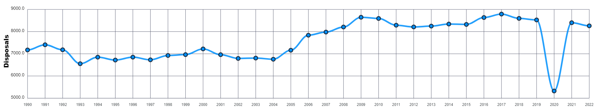
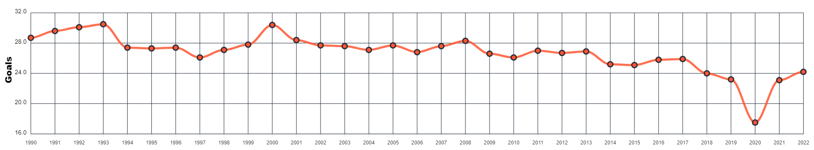
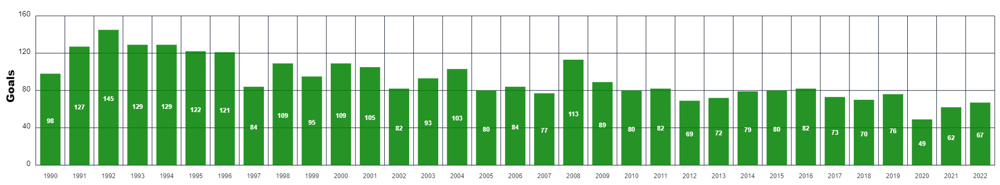

# AFL Season Analysis (1990 - 2022)

## Project Description

Analyse AFL season data (1990-2022) for disposals and goals. Determine if the number of disposals has an effect on the number of goals scored. 

### Team Members
Troy Foote

### Requirements

* Python
* Pandas
* Flask
* Json
* MongoDB
* JavaScript
* HTML
* CSS
* ApexCharts

### Questions to be answered.

#### 1. Has the game become a higher or lower disposal (faster or slower moving) game since the beginning of the AFL Competition in 1990?

Produce a chart that shows the average number of disposals per team for each completed season of AFL Football. The higher the number of disposals will generally prove a slower moving game than if there are fewer disposals.
 
 

 

#### 2. Has the style of gameplay in Question 1 reduced or increased the number of goals being scored?

Produce a chart that shows the average goals scored per game per completed season of AFL Football. Has there been an increase or decrease in the number of goals scored?
 
 

 

#### 3. How has the role of the AFL Competitions leading goal kickers changed over time?

Produce a chart showing the total number of goals scored by the Competitions leading goal kicker per completed season of AFL Football. Has the role of the Full Forward changed over the years?
 
 

 

### Notes  
##### (things to take into account when looking into the data)

* Finals System

1990 - Top 5 played Finals

1991 - 1993 Top 6 played Finals

1994 - 2022 Top 8 played Finals

* Number of Teams per Season

1990 - 14 Teams

1991 - 1994 15 Teams

1995 - 2010 16 Teams

2011 - 17 Teams

2012 - 2022 18 Teams

* When did new teams join/leave the AFL Competition

1991 - Adelaide Crows joined

1995 - Fremantle Dockers joined

1997 - Port Adelaide joined

1997 - Fitzroy merged with Brisbane

2011 - Gold Coast joined

2012 - Greater Western Sydney joined

 

### Resources
All data originally sourced from :- https://afltables.com/afl/afl_index.html 
Bob's Programming Academy :- https://www.youtube.com/watch?v=ewN4_mcaI84

